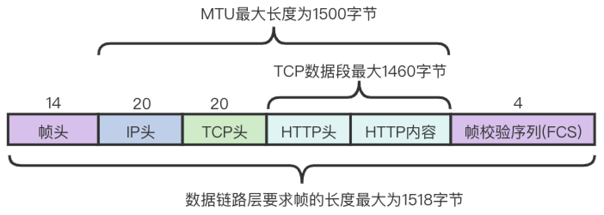
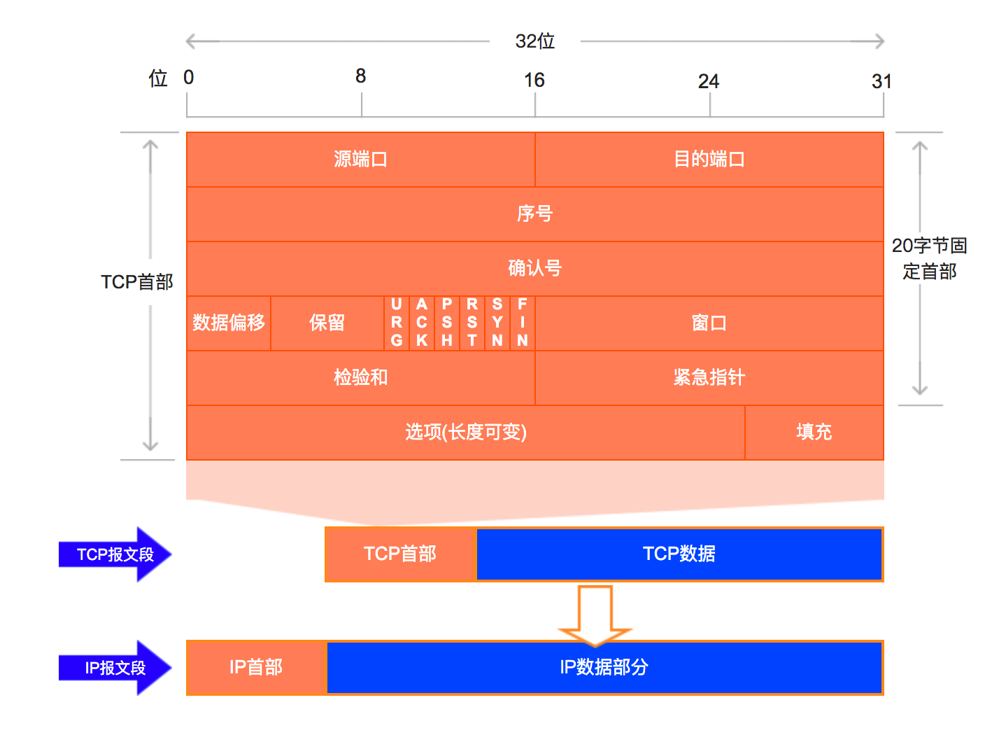
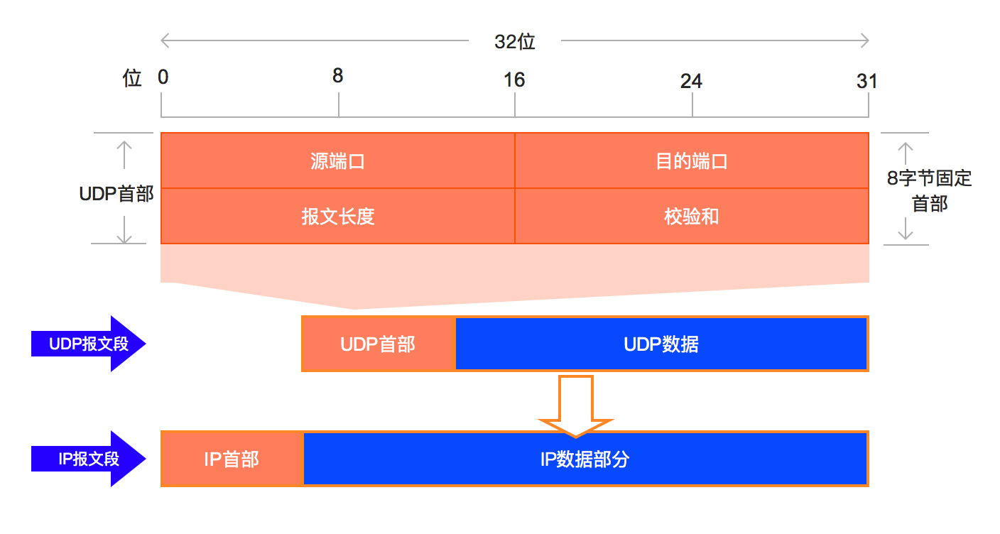
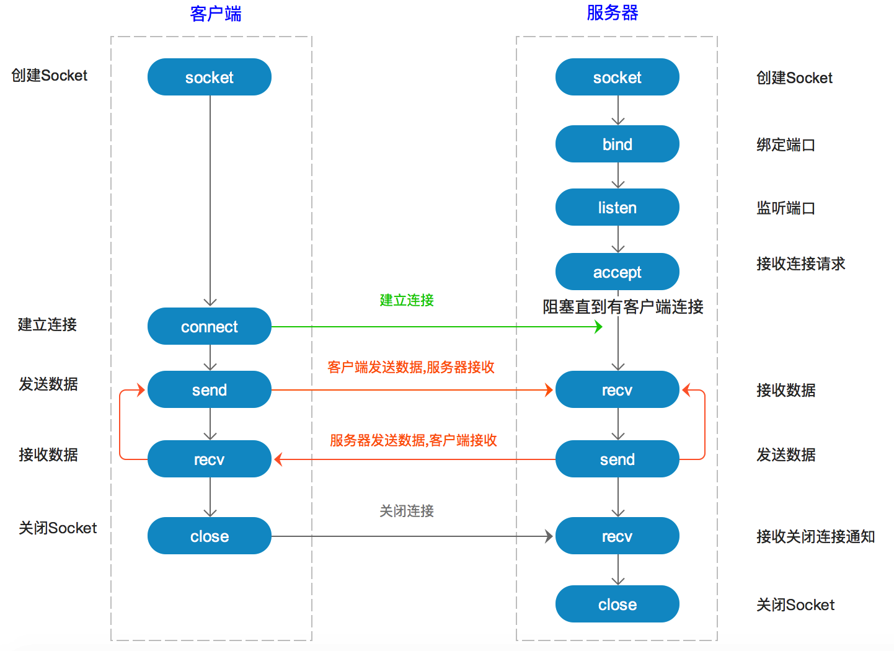
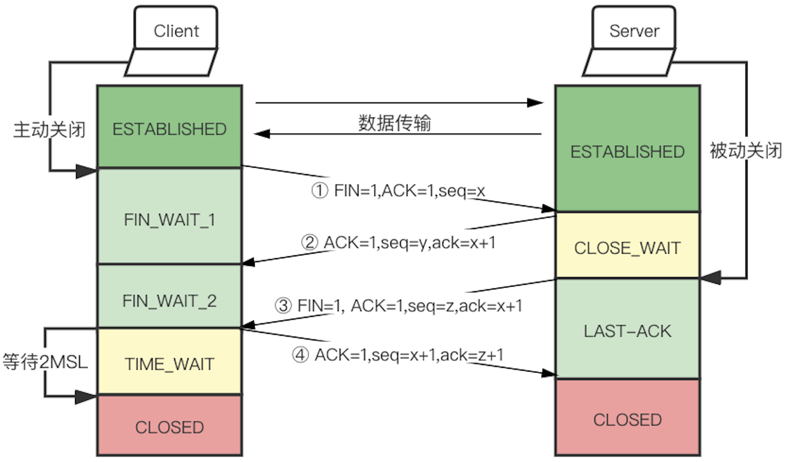

# 基础

## 数据结构与算法

###### 排序算法了解哪些，快排，快排复杂度，优化，堆排序，建堆过程

最重要的几个算法：快速排序，堆排序，归并排序，桶排序

```java
//快速排序
public void quickSort(int[] arr,int L,int R){
    if (arr.length == 0) return;
    int i = L;
    int j = R;
    int key = arr[(i + j)/2];
    while (i <= j){
        while (arr[i] < key)
            i++;
        while (arr[j] > key)
            j--;
        if (i <= j){
            int temp = arr[i];
            arr[i] = arr[j];
            arr[j] = temp;
            i++;
            j--;
        }
    }
    //上面一个while保证了第一趟排序支点的左边比支点小，支点的右边比支点大了。
    //“左边”再做排序，直到左边剩下一个数(递归出口)
    if (L < j)
        quickSort(arr,L,j);
    //“右边”再做排序，直到右边剩下一个数(递归出口)
    if(i < R)
        quickSort(arr,i,R);
}
//时间复杂度
平均：O(nlogn)最好：O(nlogn)最坏：O(n2)
//空间复杂度
 O(logn)
```

```java
//堆排序	
public class HeapSort {
 
	public static void heapSort(int[] arr) {
		if (arr == null || arr.length == 0) {
			return;
		}
		int len = arr.length;
		// 构建大顶堆，这里其实就是把待排序序列，变成一个大顶堆结构的数组
		buildMaxHeap(arr, len);
 
		// 交换堆顶和当前末尾的节点，重置大顶堆
		for (int i = len - 1; i > 0; i--) {
			swap(arr, 0, i);
			len--;
			heapify(arr, 0, len);
		}
	}
 
	private static void buildMaxHeap(int[] arr, int len) {
		// 从最后一个非叶节点开始向前遍历，调整节点性质，使之成为大顶堆
		for (int i = (int)Math.floor(len / 2) - 1; i >= 0; i--) {
			heapify(arr, i, len);
		}
	}
 
	private static void heapify(int[] arr, int i, int len) {
		// 先根据堆性质，找出它左右节点的索引
		int left = 2 * i + 1;
		int right = 2 * i + 2;
		// 默认当前节点（父节点）是最大值。
		int largestIndex = i;
		if (left < len && arr[left] > arr[largestIndex]) {
			// 如果有左节点，并且左节点的值更大，更新最大值的索引
			largestIndex = left;
		}
		if (right < len && arr[right] > arr[largestIndex]) {
			// 如果有右节点，并且右节点的值更大，更新最大值的索引
			largestIndex = right;
		}
 
		if (largestIndex != i) {
			// 如果最大值不是当前非叶子节点的值，那么就把当前节点和最大值的子节点值互换
			swap(arr, i, largestIndex);
			// 因为互换之后，子节点的值变了，如果该子节点也有自己的子节点，仍需要再次调整。
			heapify(arr, largestIndex, len);
		}
	}
 
	private static void swap (int[] arr, int i, int j) {
		int temp = arr[i];
		arr[i] = arr[j];
		arr[j] = temp;
	}
}
//时间复杂度
平均：O(nlogn)
//空间复杂度
 O(1)
```

```java
// 归并排序
public class MergeSort {
    
    public static int[] sort(int[] arr, int low, int high) {
        int mid = (low + high) / 2;
        if (low < high) {
            // 左边归并排序
            sort(arr, low, mid);
            // 右边归并排序
            sort(arr, mid + 1, high);
            // 合并两个有序数组
            merge(arr, low, mid, high);
        }
        return arr;
    }

    public static void merge(int[] arr, int low, int mid, int high) {
        int[] temp = new int[high - low + 1];
        int i = low;
        int j = mid + 1;
        int k = 0;
        while (i <= mid && j <= high) {
            // 对比大小，调整顺序
            if (arr[i] < arr[j]) {
                temp[k++] = arr[i++];
            } else {
                temp[k++] = arr[j++];
            }
        }
        // 右边剩余元素填充进temp中（因为前面已经归并，剩余的元素必会小于右边剩余的元素）
        while (i <= mid) {
            temp[k++] = arr[i++];
        }
        // 右边剩余元素填充进temp中（因为前面已经归并，剩余的元素必会大于于左边剩余的元素）
        while (j <= high) {
            temp[k++] = arr[j++];
        }
        // 调整数组顺序
        for (int x = 0; x < temp.length; x++) {
            arr[x + low] = temp[x];
        }
    }

    public static void main(String[] args) {
        int[] a = {11, 6, 4, 7, 1, 31};
        sort(a, 0, a.length -1);
        Arrays.stream(a).forEach(System.out::println);
    }
}
//时间复杂度
平均：O(nlogn)
//空间复杂度
 O(n)
```


## 网络

### Netty

###### nio讲讲，实现原理，优缺点

NIO 支持面向缓冲区的、基于通道的 IO 操作

 NIO是基于IO多路复用模型的实现，它包含三个核心组件，分别是Buffer、Channel、Selector。

传统IO是基于流的操作，NIO是基于channel和buffer进行操作。数据总是从channel读取到buffer中，或者从buffer中写入到channel中。selector用于监听多个通道的事件，比如连接的打开、数据达到等。因此，单个线程可以监听多个数据通道。

NIO是面向缓冲区的，在NIO中所有的数据都是通过缓冲区处理的。Buffer就是缓冲区对象，无论读取还是写入，数据都是先进入Buffer的。

Channel是一个通道，可以通过它读取和写入数据。与流不同的是，流是单向的，而Channel是双向的。

Selector是多路复用器，可以通过它监听网络IO的状态。它可以不断轮询注册的Channel，如果某Channel上有连接、读取、写入事件发生，则这个Channel就处于就绪状态，就会被Selector轮询出来。

优点：并发性高

缺点：不适合重操作，NIO如果用于重操作，性能不如BIO

###### io模型了解么，多 路复用，selete，poll，epoll，epoll的结构，怎么注册事件，et和lt模式

1. 阻塞IO

   用户线程发起IO读/写操作之后，线程阻塞，直到可以开始处理数据；对CPU资源的利用率不够；

2. 非阻塞IO

   发起IO请求之后可以立即返回，如果没有就绪的数据，需要不断地发起IO请求直到数据就绪；不断重复请求消耗了大量的CPU资源

3. IO多路复用

   指单个进程/线程就可以同时处理多个IO请求

   实现原理：用户将想要监视的文件描述符（File Descriptor）添加到select/poll/epoll函数中，由内核监视，函数阻塞。一旦有文件描述符就绪（读就绪或写就绪），或者超时（设置timeout），函数就会返回，然后该进程可以进行相应的读/写操作。

   **select/poll/epoll三者的区别？**

   三种函数在的 Linux 内核里有都能够支持，其中 epoll 是 Linux 所特有，而 select 则应该是 POSIX 所规定，一般操作系统均有实现。

   **select：**

   1）用户进程需要监控某些资源 fds，在调用 select 函数后会阻塞，操作系统会将用户线程加入这些资源的等待队列中。

   2）直到有描述副就绪（有数据可读、可写或有 except）或超时（timeout 指定等待时间，如果立即返回设为 null 即可），函数返回。

   3）select 函数返回后，中断程序唤起用户线程。用户可以遍历 fds，通过 FD_ISSET 判断具体哪个 fd 收到数据，并做出相应处理。
   select 函数优点明显，实现起来简单有效，且几乎所有操作系统都有对应的实现。

   select 的缺点

   1）每次调用 select 都需要将进程加入到所有监视 fd 的等待队列，每次唤醒都需要从每个队列中移除。 这里涉及了两次遍历，而且每次都要将整个 fd_set 列表传递给内核，有一定的开销。

   2）当函数返回时，系统会将就绪描述符写入 fd_set 中，并将其拷贝到用户空间。进程被唤醒后，用户线程并不知道哪些 fd 收到数据，还需要遍历一次。

   3）受 fd_set 的大小限制，32 位系统最多能监听 1024 个 fd，64 位最多监听 2048 个。

   **poll：**

   和select几乎没有区别，区别在于文件描述符的存储方式不同，poll采用链表的方式存储，没有最大存储数量的限制

   1）poll 函数采用链表的方式替代原来 select 中 fd_set 结构，因此可监听文件描述符数量不受限。

   2）poll 函数返回后，可以通过 pollfd 结构中的内容进行处理就绪文件描述符，相比 select 效率要高。

   3）新增水平触发：也就是通知程序 fd 就绪后，这次没有被处理，那么下次 poll 的时候会再次通知同个 fd 已经就绪。

   poll 缺点

   和 select 函数一样，poll 返回后，需要轮询 pollfd 来获取就绪的描述符。事实上，同时连接的大量客户端在一时刻可能只有很少的处于就绪状态，因此随着监视的描述符数量的增长，其效率也会线性下降。

   **epoll：**

   epoll 在 2.6 内核中提出，是之前的 select 和 poll 的增强版。

   epoll 使用一个文件描述符管理多个描述符，将用户进程监控的文件描述符的事件存放到内核的一个事件表中，这样在用户空间和内核空间只需拷贝一次。

   **epoll的结构**

   - **epoll_create**
   - **epoll_ctl**
     - 事件注册函数，将需要监听的事件和需要监听的 fd 交给 epoll 对象。
   - **epoll_wait**
     - 等待 epfd 上的 io 事件，最多返回 maxevents 个事件。

   通过内核和用户空间共享内存，避免了不断复制的问题；

   支持的同时连接数上限很高（1G左右的内存支持10W左右的连接数）；

   文件描述符就绪时，采用回调机制，避免了轮询（回调函数将就绪的描述符添加到一个链表中，执行epoll_wait时，返回这个链表）；

   支持水平触发和边缘触发，采用边缘触发机制时，只有活跃的描述符才会触发回调函数。

   **什么时候使用select/poll，什么时候使用epoll？**

   当连接数较多并且有很多的不活跃连接时，epoll的效率比其它两者高很多；但是当连接数较少并且都十分活跃的情况下，由于epoll需要很多回调，因此性能可能低于其它两者。

   **什么是文件描述符？**

   文件描述符在形式上是一个非负整数。实际上，它是一个索引值，指向内核为每一个进程所维护的该进程打开文件的记录表。当程序打开一个现有文件或者创建一个新文件时，内核向进程返回一个文件描述符。

   内核通过文件描述符来访问文件。文件描述符指向一个文件。

   **什么是水平触发？什么是边缘触发？**

   水平触发（LT，Level Trigger）模式下，只要一个文件描述符就绪，就会触发通知，如果用户程序没有一次性把数据读写完，下次还会通知；
   边缘触发（ET，Edge Trigger）模式下，当描述符从未就绪变为就绪时通知一次，之后不会再通知，直到再次从未就绪变为就绪（缓冲区从不可读/写变为可读/写）。
   区别：边缘触发效率更高，减少了被重复触发的次数，函数不会返回大量用户程序可能不需要的文件描述符。
   **为什么边缘触发一定要用非阻塞（non-block）IO：**

   避免由于一个描述符的阻塞读/阻塞写操作让处理其它描述符的任务出现饥饿状态。

   ET 是一种高速工作方式，很大程度上减少了 epoll 事件被重复触发的次数。epoll 工作在 ET 模式的时候，必须使用非阻塞套接口，以避免由于一个文件句柄的阻塞读/阻塞写操作把处理多个文件描述符的任务饿死。

   **epoll为何高效**

   1） epoll 精巧的使用了 3 个方法来实现 select 方法要做的事，分清了频繁调用和不频繁调用的操作。

   epoll_ctrl 是不太频繁调用的，而 epoll_wait 是非常频繁调用的。而 epoll_wait 却几乎没有入参，这比 select 的效率高出一大截，而且，它也不会随着并发连接的增加使得入参越发多起来，导致内核执行效率下降。

   2） mmap 的引入，将用户空间的一块地址和内核空间的一块地址同时映射到相同的一块物理内存地址（不管是用户空间还是内核空间都是虚拟地址，最终要通过地址映射映射到物理地址），使得这块物理内存对内核和对用户均可见，减少用户态和内核态之间的数据交换。

   3）红黑树将存储 epoll 所监听的 FD。高效的数据结构，本身插入和删除性能比较好，时间复杂度O(logN)。

   **epoll 优点**

   1）没有最大并发连接的限制，能打开的 FD 的上限远大于 1024。

   2）效率提升，不是轮询的方式，不会随着 FD 数目的增加效率下降。

   3）内存拷贝，利用 mmap() 文件映射内存加速与内核空间的消息传递，即 epoll 使用 mmap 减少复制开销。

   4）新增 ET 模式

4. 信号驱动IO

5. 异步IO

   用户线程发出IO请求之后，继续执行，由内核进行数据的读取并放在用户指定的缓冲区内，在IO完成之后通知用户线程直接使用

   **同步和异步的概念**描述的是用户线程与内核的交互方式：同步是指用户线程发起IO请求后需要等待或者轮询内核IO操作完成后才能继续执行；而异步是指用户线程发起IO请求后仍继续执行，当内核IO操作完成后会通知用户线程，或者调用用户线程注册的回调函数。

   **阻塞和非阻塞的概念**描述的是用户线程调用内核IO操作的方式：阻塞是指IO操作需要彻底完成后才返回到用户空间；而非阻塞是指IO操作被调用后立即返回给用户一个状态值，无需等到IO操作彻底完成。

###### 了解netty么，讲讲netty的设计模型，架构，使用场景

### TCP&UDP

###### OSI





###### tcp和udp的报文结构了解么





###### tcp和udp的区别，tcp怎么保证可靠连接的，出现网络拥塞怎么解决

| 类型 |            特点            |          性能          |    应用过场景    | 首部字节 |      |
| ---- | :------------------------: | :--------------------: | :--------------: | :------: | ---- |
| TCP  |   面向连接、可靠、字节流   | 传输效率慢、所需资源多 |  文件、邮件传输  |  20-60   |      |
| UDP  | 无连接、不可靠、数据报文段 | 传输效率快、所需资源少 | 语音、视频、直播 | 8个字节  |      |

**tcp怎么保证可靠连接的**

1)连接管理
TCP是面向连接的，三次握手四次挥手都保证了连接的可靠性。

2)序列号
TCP是面向字节流的，它要求数据报按次序到达。发送端会为每一个字节流添加一个序号，会按照序号的顺序向接收端发送数据报，而接收端也会按照顺序接受这些数据报，如果中间一个序列号的数据包丢了，虽然它还是会接受这些数据包，但是它也会重复发送丢失的数据报之前的确认报文段，来告诉发送端重发这个数据报，以保证发送端发送丢失的数据报。

3)超时重传
当TCP发送了一个数据包时，会启动一个定时器，如果在有一定的时间内没有收到接收端的确认报文段，就会重新发送这个数据包。

4)流量控制
发送端会根据接收端处理数据的能力调整发送速度。首先，接受端将自己处理数据的缓冲区的空闲区域的大小写入到TCP报文头部的窗口大小中，通过ACK确认报文段发送给发送端，发送端接收到这个报文之后，会根据窗口的信息调整自己发送数据的能力。比如，接收端的缓冲区快满了，它将窗口大小调小，发送端接收到这个信息后会放缓发送数据报的速度。接受端的缓冲区彻底满了之后，它会将窗口大小的信息设置为0，发送端接收到窗口信息后，会停止发送信息，但是会隔一段时间发送一个探测的报文段，来查看接收端的缓冲区状态。
5)拥塞控制
由慢启动，拥塞避免，快重传，快恢复四个核心算法组成。
①**慢启动**，当主机启动开始发送数据时，会先探测性的调到一个很小的窗口大小，（因为它不知道网络状态，一下子放入大量数据报可能会导致网络拥塞或者丢包），随着发送的次数增加，窗口大小也成倍增加。
②**拥塞避免**，为了避免窗口拥塞，会放缓窗口的增加速度，每次会使窗口的大小+1。
③**快重传**，当发送端连续三次接收到同一个报文段的确认报文时，会直接启动快重传算法，发送这个报文段后边的丢失的那个报文段。
④**快恢复**，为了避免是因为直接重传而造成网络堵塞，在它之后会继续执行第二步拥塞算法。

###### socket了解么，tcp和udp的实现区别，不了解，用的不多



###### tcp连接client和server有哪些状态，time_wait状态




###### linux最多可以建立多少个tcp连接，client端，server端，超过了怎么办

**client最大tcp连接数**

client每次发起tcp连接请求时，除非绑定端口，通常会让系统选取一个空闲的本地端口（local port），该端口是独占的，不能和其他tcp连接共享。tcp端口的数据类型是unsigned short，因此本地端口个数最大只有65536，端口0有特殊含义，不能使用，这样可用端口最多只有65535，所以在全部作为client端的情况下，一个client最大tcp连接数为65535，这些连接可以连到不同的serverip。

**server最大tcp连接数**

server通常固定在某个本地端口上监听，等待client的连接请求。不考虑地址重用（unix的SO_REUSEADDR选项）的情况下，即使server端有多个ip，本地监听端口也是独占的，因此server端tcp连接4元组中只有remoteip（也就是clientip）和remote port（客户端port）是可变的，因此最大tcp连接为客户端ip数×客户端port数，对IPV4，不考虑ip地址分类等因素，最大tcp连接数约为2的32次方（ip数）×2的16次方（port数），也就是server端单机最大tcp连接数约为2的48次方。

**实际的tcp连接数**

上面给出的是理论上的单机最大连接数，在实际环境中，受到机器资源、操作系统等的限制，特别是sever端，其最大并发tcp连接数远不能达到理论上限。在unix/linux下限制连接数的主要因素是内存和允许的文件描述符个数（每个tcp连接都要占用一定内存，每个socket就是一个文件描述符），另外1024以下的端口通常为保留端口。

所以，对server端，通过增加内存、修改最大文件描述符个数等参数，单机最大并发TCP连接数超过10万,甚至上百万是没问题的。

###### dos攻击，ddos攻击，drdos攻击，怎么解决，syn flood

### HTTP&HTTPS

###### http请求头，expire，cache-control字段，状态码，301，302，401，403

**请求头、响应头（Header）=起始行(请求方法+URL+HTTP版本)（start line）+头部字段（header）**

**通用头标：**即可用于请求，也可用于响应，是作为一个整体而不是特定资源与事务相关联。

Cache-Control：告诉所有的缓存机制是否可以缓存及哪种类型。

Connection:表示是否需要持久连接。（HTTP 1.1默认进行持久连接）

**请求头标：**允许客户端传递关于自身的信息和希望的响应形式。

Authorization:告知服务器客户端的Web认证信息。

User-Agent:告知服务器HTTP 客户端程序的信息。

**响应头标：**服务器和于传递自身信息的响应。

**实体头标：**定义被传送资源的信息。即可用于请求，也可用于响应。

Content-Encoding:实体报文用来压缩媒体类型，指示了对实体应用了何种编码（常见的内容编码有 gzip、compress、deflate、identity）

Content-Type:返回内容的MIME类型。

Expires：响应过期的日期和时间。

**状态码：**

​		100：Continue --- 继续。客户端应继续其请求。

​		200：OK --- 请求成功。一般用于GET与POST请求。

​		301：Moved Permanently --- 永久重定向。

​		302：Found --- 暂时重定向。

​		400：Bad Request --- 客户端请求的语法错误，服务器无法理解。

​		401：Unauthorized---请求要求身份验证。 对于需要登录的网页，服务器可能返回此响应。

​		403：Forbideen --- 服务器理解请求客户端的请求，但是拒绝执行此请求。

​		404：Not Found --- 服务器无法根据客户端的请求找到资源（网页）。

​		500：Internal Server Error --- 服务器内部错误，无法完成请求。

​		502：Bad Gateway --- 作为网关或者代理服务器尝试执行请求时，从远程服务器接收到了无效的响应。


###### https原理，数字签名，数字证书，非对称加密算法过程，有什么问题

## 操作系统

### 进程管理

###### 怎么理解用户态，内核态，为什么要分级别，有几种转换的方式，怎么转换的，转换失败怎么办

###### fork函数，父子进程的区别，孤儿进程，僵尸进程会有什么问题，进程有哪些状态，进程间怎么同步，通信，消息队列，管道怎么实现的，进程调度算法，各有什么优缺点

###### 自旋锁，线程上下文切换的开销具体是什么，中断，有哪些中断，用户态和内核态切换过程

### 内存管理

###### 虚拟内存，虚拟地址和物理地址怎么转换，内存分段，内存分页，优缺点

# MySQL

### ID

###### 你们建表会定义自增id么，为什么，自增id用完了怎么办

如果设置了主键，那么将会报错主键冲突。mysql数据库表的自增 ID 达到上限之后，这时候再申请它的值就不会再改变了，如果继续插入数据就会导致报主键冲突异常。

如果没有设置主键，数据库则会帮我们自动生成一个全局的row_id，新数据会覆盖老数据

### Innodb

###### Innodb的结构了解么，磁盘页和缓存区是怎么配合，以及查找的，缓冲区和磁盘数据不一致怎么办，mysql突然宕机了会出现数据丢失么

### 事务&锁

###### mysql事务，acid，实现原理，脏读，脏写，隔离级别，实现原理，mvcc，幻读，间隙锁原理，什么情况下会使用间隙锁，锁失效怎么办，其他锁了解么，行锁，表锁

多个操作同时进行,那么同时成功，那么同时失败。这就是事务。

**原⼦性：** 事务是最⼩的执⾏单位，不允许分割。事务的原⼦性确保动作要么全部完成，要么全不执行

**一致性：** 执⾏事务前后，数据保持⼀致，多个事务对同⼀个数据读取的结果是相同的；

**隔离性：** 并发访问数据库时，⼀个⽤户的事务不被其他事务所⼲扰，各并发事务之间数据库是独⽴的；

**持久性：** ⼀个事务被提交之后。它对数据库中数据的改变是持久的，即使数据库发⽣故障也不应该对其有任何影响。

MySQL的存储引擎InnoDB使用redo log保证一致性与持久性，undo log日志保证原子性，使用各种锁来保证隔离性。

**读未提交**Read Uncommited**：**最低的隔离级别，允许读取尚未提交的数据变更，可能会导致脏读、幻读或不可重复读。

**读已提交**Read Committed（RC）**：**允许读取并发事务已经提交的数据，可以阻⽌脏读，但是幻读或不可重复读仍有可能发⽣。

**可重复读**Repeatable Read（RR）**：**同⼀字段的多次读取结果都是⼀致的，除⾮数据是被本身事务⾃⼰所修改，可以阻⽌脏读和不可重复读，但幻读仍有可能发⽣。

**可串行化**Serializable**：**最⾼的隔离级别，完全服从ACID的隔离级别。所有的事务依次逐个执⾏，这样事务之间就完全不可能产⽣⼲扰，也就是说，该级别可以防⽌脏读、不可重复读以及幻读。     

| 隔离级别 | 并发问题                         |
| -------- | -------------------------------- |
| 读未提交 | 可能会导致脏读、幻读或不可重复读 |
| 读已提交 | 可能会导致幻读或不可重复读       |
| 可重复读 | 可能会导致幻读                   |
| 可串行化 | 不会产⽣⼲扰                     |

脏读：脏读就是指当一个事务正在访问数据，并且对数据进行了修改，而这种修改还没有提交到数据库中，这时，另外一个事务也访问这个数据，然后使用了这个数据。

不可重复读（重点是修改）：是指在一个事务内，多次读同一数据。在这个事务还没有结束时，另外一个事务也访问该同一数据。那么，在第一个事务中的两次读数据之间，由于第二个事务的修改，那么第一个事务两次读到的的数据可能是不一样的。这样就发生了在一个事务内两次读到的数据是不一样的，因此称为是不可重复读。

幻读（重点在于新增或者删除）：是指当事务不是独立执行时发生的一种现象，例如第一个事务对一个表中的数据进行了修改，这种修改涉及到表中的全部数据行。同时，第二个事务也修改这个表中的数据，这种修改是向表中插入一行新数据。那么，以后就会发生操作第一个事务的用户发现表中还有没有修改的数据行，就好象发生了幻觉一样。

**LBCC:基于锁的并发控制**

InnoDB引擎的行锁机制，锁的是索引，而不是行记录。

共享锁S（行锁，读锁）

```sql
*//加锁* 
select * from table lock in share mode; *
//释放锁* 
Commit； 
Rollback；
```

排他锁X（行锁、写锁）

```sql
//排它锁加锁方式
自动：
DML语句默认会自动加锁；
手动：
select * from user where id = 1 for update;

//释放锁
Commit;
Rollback;
```

意向锁（表锁）**意向共享锁IS,意向排它锁IX**

S锁和X锁使用时，会触发建立意向锁。且IS、IX锁均是表锁，且无法手动创建。

当我们准备对整张表操作的时候，需要先看一下该表是否有数据正在被占用，而表的意向锁就可以让我们直观的知道该表是否被占用，而不用去遍历数据行判断。

记录锁（Record Lock）: 

对索引项加锁，锁定符合条件的行。其他事务不能修改和删除加锁项；

```sql

select * from table where id = 12 for update
//等值查询
```


间隙锁（Gap Lock）: 

对索引项之间的“间隙”加锁，锁定记录的范围（对第一条记录前的间隙或最后一条将记录后的间隙加锁），不包含索引项本身。其他事务不能在锁范围内插入数据，这样就防止了别的事务新增幻影行。

```sql
//Session A
select * from table where id > 12 for update
//上面sql实际上锁住的区间是 大于10的区间，如下
//Session B
update table set name = 'xinwei' where id = 11;
//这个情况下，Session B这条语句是执行不成功的，只可以修改 <= 10这个范围的记录
```


Next-key Lock： 

锁定索引项本身和索引范围。即Record Lock和Gap Lock的结合。可解决幻读问题。

```sql
select * from where id > 1 and id < 10 for update
```


**MVCC：基于多版本快照的实现**

​		MVCC是一种多版本并发控制机制，在大多数情况下代替行级锁,使用MVCC,能降低其系统开销.

​		MVCC是通过保存数据在某个时间点的快照来实现的. 不同存储引擎的MVCC实现是不同的,典型的有乐观并发控制和悲观并发控制.

​		InnoDB的MVCC,是通过在每行记录后面保存两个隐藏的列来实现的,这两个列，分别保存了这个行的创建时间，一个保存的是行的删除时间。这里存储的并不是实际的时间值,而是系统版本号(可以理解为事务的ID)，每开始一个新的事务，系统版本号就会自动递增，事务开始时刻的系统版本号会作为事务的ID.

​		InnoDB只会查找版本早于当前事务版本的数据行(也就是,行的系统版本号小于或等于事务的系统版本号)，这样可以确保事务读取的行，要么是在事务开始前已经存在的，要么是事务自身插入或者修改过的.

​		1.MVCC手段只适用于Msyql隔离级别中的读已提交（Read committed）和可重复读（Repeatable Read）.

​		2.Read uncimmitted由于存在脏读，即能读到未提交事务的数据行，所以不适用MVCC.

​		原因是MVCC的创建版本和删除版本只要在事务提交后才会产生。客观上，我们认为他就是乐观锁的一整实现方式，就是每行都有版本号，保存时根据版本号决定是否成功。


没有索引或者索引失效时，InnoDB 的行锁变表锁


###### mysql多事务执行会产生哪些问题，怎么解决这些问题

脏写、脏读、不可重复读、幻读

**脏写，丢失修改**

在第一个事务中修改了数据后，第二个事务也修改了这个数据。这样第一个事务内的修改结果就被丢失，因此称为丢失修改。

解决方案：
解决更新丢失主要有以下两个方式：

1. 使用事务+锁定读，也就是for update

2. 不使用事务，用CAS自旋来操作

**脏读、不可重复读和幻读其实都是数据库读一致性问题，必须由数据库提供一定的事务隔离机制来解决**


###### 使用过事务么，遇到过事务失效的情况么，原因是什么

 		**注解@Transactional配置的方法非public权限修饰；**

如果要用在非 public 方法上，可以开启 AspectJ 代理模式。

 		**注解@Transactional所在类非Spring容器管理的bean；**
 		 **注解@Transactional所在类中，注解修饰的方法被类内部方法调用；**

并非是代理类调用，而是直接通过原有的Bean直接调用 

类内部使用其代理类调用事务方法，启动类上要添加`@EnableAspectJAutoProxy(exposeProxy = true)`注解		

​		**业务代码抛出异常类型非RuntimeException，事务失效；**

@Transactional注解修饰的方法，加上rollbackfor属性值，指定回滚异常类型：`@Transactional(propagation = Propagation.REQUIRED,rollbackFor = Exception.class)`

 		**业务代码中存在异常时，使用try…catch…语句块捕获，而catch语句块没有throw new RuntimeExecption异常;（最难被排查到问题且容易忽略）**

解决方案：捕获异常并抛出异常

 		**注解@Transactional中Propagation属性值设置错误即Propagation.NOT_SUPPORTED（一般不会设置此种传播机制）**
 		**mysql关系型数据库，且存储引擎是MyISAM而非InnoDB，则事务会不起作用(基本开发中不会遇到)；**

### 索引

###### mysql索引左前缀原理，怎么优化，哪些字段适合建索引，索引有什么优缺点

###### mysql中有一个索引(a,b,c)，有一条sql，where a = 1 and b > 1 and c =1;可以用到索引么，为什么没用到，B+树的结构，为什么不用红黑树，B树，一千万的数据大概多少次io

###### mysql聚簇索引，覆盖索引，底层结构，主键索引，没有主键怎么办，会自己生成主键为什么还要自定义主键，自动生成的主键有什么问题

###### 一般你们怎么建mysql索引，基于什么原则，遇到过索引失效的情况么，怎么优化的

### 日志

###### mysql日志文件有哪些，分别介绍下作用

### 优化

###### 线上遇到过慢查询么，怎么定位，优化的，explain，using filesort表示什么意思，产生原因，怎么解决

###### 线上有遇到大流量的情况么，产生了什么问题，为什么数据库2000qps就撑不住了，有想过原因么，你们当时怎么处理的

###### 一张大表怎么更改表的数据结构，字段，用alter会有什么问题，怎么解决呢，有什么好的方案，双写的话会有什么问题，还有其他方案么

### 主从

###### mysql主从复制，主从延时怎么解决

### 分库分表

###### 分库分表做过么，怎么做到不停机扩容，双写数据丢失怎么办，跨库事务怎么解决

###### 做过分库分表么，为什么要分库分表，会有什么问题，多少数据适合分库分表，跨库，聚合操作怎么做

# Redis

### 特性

###### 你们项目为什么用redis，快在哪，怎么保证高性能，高并发的

###### redis线程模型，单线程有什么优缺点，为什么单线程能保证高性能，什么情况下会出现阻塞，怎么解决

###### 你们用redis么，用来做什么，什么场景使用的，遇到过什么问题，怎么解决的

### 数据结构

###### redis字典结构，hash冲突怎么办，rehash，负载因子

###### redis字符串实现，sds和c区别，空间预分配

###### redis有序集合怎么实现的，跳表是什么，往跳表添加一个元素的过程，添加和获取元素，获取分数的时间复杂度，为什么不用红黑树，红黑树有什么特点，左旋右旋操作

###### 怎么统计一亿用户的日活，hyperloglog有什么缺点，bitmap不行么

###### redis的几种数据类型，你们用过哪些，zset有用来做什么

### 集群

###### redis集群，为什么是16384，哨兵模式，选举过程，会有脑裂问题么，raft算法，优缺点

###### 你们用的redis集群么，扩容的过程，各个节点间怎么通信的

### 持久化

###### .redis持久化过程，aof持久化会出现阻塞么，一般什么情况下使用rdb，aof

### 击穿&穿透&雪崩

###### redis缓存穿透，布隆过滤器，怎么使用，有什么问题，怎么解决这个问题

### 分布式

###### redis分布式锁，过期时间怎么定的，如果一个业务执行时间比较长，锁过期了怎么办，怎么保证释放锁的一个原子性，你们redis是集群的么，讲讲redlock算法

###### redis强一致性么，怎么保证强一致性，有什么方案

###### redis实现分布式锁，还有其他方式么，zookeeper怎么实现，各有什么有缺点，你们为什么用redis实现

### 一致性

###### 怎么保证redis和mysql的一致性，redis网络原因执行超时了会执行成功么，那不成功怎么保证数据一致性

### 管道&事务

###### redis管道用过么，用来做什么，它的原理是，保证原子性么，和事务的区别，redis事务保证原子性么

# Java

### 集合

###### hashmap原理，put和get，为什么是8转红黑树，红黑树节点添加过程，什么时候扩容，为什么是0.75，扩容步骤，为什么分高低位，1.7到1.8有什么优化，hash算法做了哪些优化，头插法有什么问题，为什么线程不安全

###### arraylist原理，为什么数组加transient，add和get时间复杂度，扩容原理，和linkedlist区别，原理，分别在什么场景下使用，为什么

###### treemap和linkdedhashmap区别，实现原理

### 对象

###### new Object[100]对象大小，它的一个对象引用大小，对象头结构

### 异常

###### 怎么理解异常，它的作用是什么，你们工作中是怎么使用的

### 反射

###### 反射了解么，原理是什么

### 函数

###### 函数a调用函数b的过程，是怎么传参的

###### java里面的函数调用有哪些，io流里面有函数调用么

# 并发

### 锁&线程安全

###### 线程有哪些状态，等待状态怎么产生，死锁状态的变化过程，中止状态，interrupt()方法

###### 你怎么理解线程安全，哪些场景会产生线程安全问题，有什么解决办法

**线程安全**：

当多个线程访问一个对象时，如果不用进行额外的同步控制或其他的协调操作，调用这个对象的行为都可以获得正确的结果

**产生：**当多个线程操作共享空间中的变量时，就有可能造成线程安全问题

**解决办法**

​	1.避免线程修改共享空间中变量的值

​    2.使用无状态对象，即不共享状态（数据）给多个线程

​    3.使用不可变对象，不可修改，就不会存在读写不一致的问题

​    4.使用线程特有对象，如TheadLocal

​    5.装饰者模式，即使用原子类，原子操作

​    6.使用锁，保证线程同步，如Syconized,RetranceLock等

###### 了解哪些并发工具类

###### 线程安全的类有哪些，平时有使用么，用来解决什么问题

###### 你了解那些锁，乐观锁和悲观锁，为什么读要加锁，乐观锁为什么适合读场景，写场景不行么，会有什么问题，cas原理

###### 什么情况下产生死锁，怎么排查，怎么解决

互斥条件是指**多个线程不能同时使用同一个资源**。

持有并等待条件**线程 A 在等待资源 2 的同时并不会释放自己已经持有的资源 1**。

不可剥夺条件是指，当线程已经持有了资源 ，**在自己使用完之前不能被其他线程获取**

环路等待条件指都是，在死锁发生的时候，**两个线程获取资源的顺序构成了环形链**

使用 `jstack` 工具，它是 jdk 自带的线程堆栈分析工具

死锁问题的产生是由两个或者以上线程并行执行的时候，争夺资源而互相等待造成的。

死锁只有同时满足互斥、持有并等待、不可剥夺、环路等待这四个条件的时候才会发生。

所以要避免死锁问题，就是要破坏其中一个条件即可，最常用的方法就是使用资源有序分配法来破坏环路等待条件。

###### while(true)里面一直new thread().start()会有什么问题

大量的创建线程，非常影响项目的性能，尤其是在一些大并发量访问的时候，经常导致后果是cpu 100%

### synchronized

###### 锁升级过程，轻量锁可以变成偏向锁么，偏向锁可以变成无锁么，自旋锁，对象头结构，锁状态变化过程

###### synchronized原理，怎么保证可重入性，可见性，抛异常怎么办，和lock锁的区别，2个线程同时访问synchronized的静态方法，2个线程同时访问一个synchronized静态方法和非静态方法，分别怎么进行

### reentrantlock

###### reentrantlock的实现原理，加锁和释放锁的一个过程，aqs，公平和非公平，可重入，可中断怎么实现的

### volatile

###### volatile作用，原理，怎么保证可见性的，内存屏障

### 集合

###### concurrenthashmap原理，put，get，size，扩容，怎么保证线程安全的，1.7和1.8的区别，为什么用synchronized，分段锁有什么问题，hash算法做了哪些优化

### threadlocal

###### threadlocal用过么，什么场景下使用的，原理，hash冲突怎么办，扩容实现，会有线程安全问题么，内存泄漏产生原因，怎么解决

### 线程池

###### 线程池原理，核心参数，线程数设置，参数动态调整后变化过程，Tomcat线程池原理，常用的线程池，你们一般使用哪种，为什么，会有什么问题，线程抛异常怎么办，阻塞队列原理

# JVM

### 参数

###### jvm了解哪些参数，用过哪些指令

###### 什么对象会进入老年代，eden和survivor比例可以调整么，参数是什么，调整后会有什么问题

### 类加载

###### jvm类加载器，自定义类加载器，双亲委派机制，优缺点，tomcat类加载机制

###### tomcat热部署，热加载了解么，怎么做到的

###### jvm类加载的过程讲讲，符号引用是什么，哪些情况会发生初始化

### 垃圾回收

###### cms收集器过程，g1收集器原理，怎么实现可预测停顿的，region的大小，结构

###### 垃圾收集算法，各有什么优缺点，gc roots有哪些，什么情况下会发生full gc

###### 垃圾收集器，cms垃圾收集过程，为什么停顿时间短，有什么缺点，concurrent mode failure怎么办，内存碎片怎么解决，为什么不用标记整理法

### 内存结构

###### 内存溢出，内存泄漏遇到过么，什么场景产生的，怎么解决的

###### 对象一定分配在堆上么，JIT，分层编译，逃逸分析

###### jvm元空间内存结构，永久代有什么问题

###### jvm内存结构，堆结构，栈结构，a+b操作数栈过程，方法返回地址什么时候回收，程序计数器什么时候为空

# Spring

### Bean

###### spring你比较了解哪方面，讲讲，生命周期，bean创建过程

###### spring的循环依赖，怎么解决的，为什么需要加个三级缓存，二级不行么

### AOP

###### 对spring aop的理解，解决什么问题，实现原理，jdk动态代理，cglib区别，优缺点，怎么实现方法的调用的

### springboot

###### springboot有什么特点，相比与spring，了解springboot的自动装配的一个原理么

###### springboot是怎么加载类的，通过什么方式


# 分布式微服务

### springcloud

###### eureka原理，强一致性么，为什么，怎么保证强一致性，多级缓存怎么保证一致性，eureka集群，宕机了服务还能调用么

###### hystrix原理，半开状态知道么，具体的一个转换过程，它的隔离是怎么实现的

###### dubbo和spring cloud区别，具体区别，分别什么场景使用

#### 理论

###### 怎么理解分布式和微服务，为什么要拆分服务，会产生什么问题，怎么解决这些问题

###### 怎么理解高可用，如何保证高可用，有什么弊端，熔断机制，怎么实现

###### 给了几个场景解决分布式事务问题

###### 对于高并发怎么看，怎么算高并发，你们项目有么，如果有会产生什么问题，怎么解决

###### 一致性hash原理，解决什么问题，数据倾斜，为什么是2的32次方，20次方可以么

###### 怎么理解幂等性，有遇到过实际场景么，怎么解决的，为什么用redis，redis过期了或者数据没了怎么办

###### 容器化技术了解么，主要解决什么问题，原理是什么

# Zookeeper

###### zookeeper的基本原理，数据模型，znode类型，应用场景有哪些

###### zookeeper一致性保证，zab协议原理，半数原则如果查询到另外一半呢，那zookeeper属于哪种一致性，强一致性么，还是最终一致性

###### zookeeper选举机制，选举过程有什么问题

###### zookeeper读写数据过程

# Kafka

###### kafka重平衡，重启服务怎么保证kafka不发生重平衡，有什么方案

###### 你们用的什么消息中间件，kafka，为什么用kafka，高吞吐量，怎么保证高吞吐量的，设计模型，零拷贝

###### kafka是怎么保证高可用性的，讲讲它的设计架构，为什么读写都在主分区，这样有什么优缺点

###### 你们为什么要用mq，遇到过什么问题么，怎么就解决的

###### kafka怎么保证消息不丢失的

###### kafka支持事务么，你们项目中有使用么，它的原理是什么

# ES

###### es的写入，查询过程，底层实现，为什么这么设计

###### es集群，脑裂问题，怎么产生的，如何解决

###### es倒排索引，原理，lucene，分词，分片，副本

###### es写数据原理，数据实时么，为什么不实时，会丢数据么，segment，cache，buffer，translog关系

###### es深度分页，优化

# 线上问题&思想&设计题

###### 讲讲你最熟悉的技术，jvm，mysql，redis，具体哪方面

###### 你平时开发中怎么解决问题，假如现在线上有一个告警，你的解决思路，过程

###### 了解哪些设计模式，工厂，策略，装饰者，桥接模式讲讲，单例模式会有什么问题

###### 了解DDD么，不是很了解

###### 限流怎么做，如果让你设计一个限流系统，怎么实现

###### 微信朋友圈设计，点赞，评论功能实现，拉黑呢，redis数据没了怎么办

###### 一个热榜功能怎么设计，怎么设计缓存，如何保证缓存和数据库的一致性

###### 设计一个秒杀系统能承受千万级并发，如果redis也扛不住了怎么办